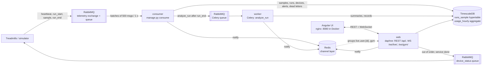
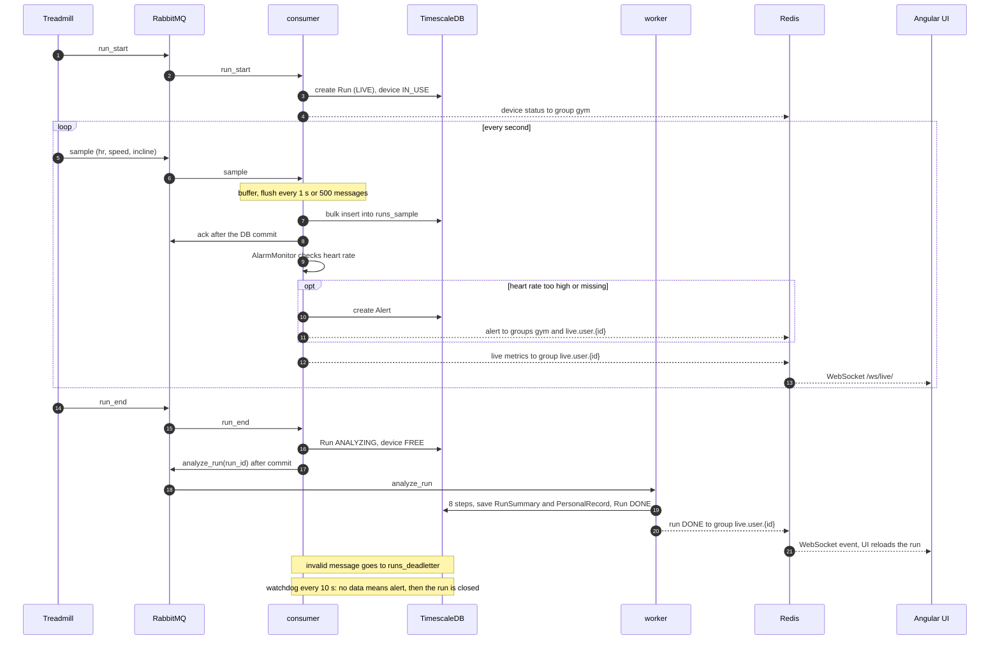
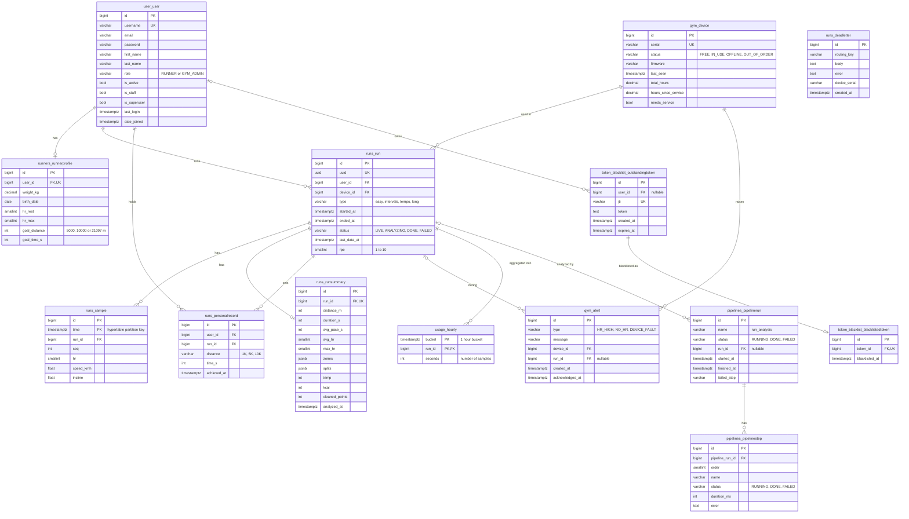

# RunPulse

RunPulse monitors the treadmills in a gym. The treadmills send telemetry through RabbitMQ, the backend stores it and shows it live. A runner watches their run live and gets an analysis when it ends. The gym admin watches the machines, alerts and utilization.

**Stack:** Django 5.2 + DRF + Channels, TimescaleDB, RabbitMQ, Celery, Redis, Angular, Docker. A Python simulator plays the treadmills.

- **Telemetry:** a treadmill publishes `run_start`, `sample` (every second), `heartbeat` and `run_end` to RabbitMQ. The `consumer` writes them in batches (500 messages or 1 s) and acks after the DB commit.
- **Live data:** the consumer pushes the metrics through Redis to WebSockets (Django Channels).
- **Analysis:** after `run_end` a Celery worker computes splits, heart rate zones and personal records.
- **Monitoring:** heart rate alerts, a watchdog for runs without data and offline treadmills, and a dead letter table for invalid messages.

## Demo accounts

| Username | Password | Role |
| --- | --- | --- |
| `admin` | `admin` | gym admin, also superuser in the Django admin |
| `manager` | `demo1234` | gym admin |
| `filip` | `filip123` | runner |
| `runner` | `demo1234` | runner |
| `member001` … `member120` | `demo1234` | gym members (runners) |
| `loadbot` | `demo1234` | load test runner, created by `seed_load` |

## How to run

Everything runs in Docker:

```bash
make up
```

Without `make` it is `docker compose up -d --build`. The first start takes about a minute: `web` runs the migrations and seeds the demo data, the other containers wait until it is healthy. `docker compose ps` should show every container as `healthy` or `running`.

| Service | Address |
| --- | --- |
| UI | http://localhost:8080 |
| API | http://localhost:8000 |
| Django admin | http://localhost:8000/admin/ |
| Health | http://localhost:8000/health/ |
| RabbitMQ admin | http://localhost:15672 (`runpulse` / `runpulse`) |

The `simulator` container runs a live gym at 60× speed on its own.

More simulator data:

```bash
docker compose run --rm simulator python simulator.py backfill --weeks 8
docker compose run --rm simulator python simulator.py run --user filip --speedup 10
```

Load test:

```bash
docker compose exec web python manage.py seed_load
docker compose run --rm simulator python simulator.py load --devices 500 --rate 10 --duration 60
```

Stop with `make down`. `docker compose down -v` also deletes the data.

### If you don't want Docker

Only the infrastructure runs in Docker, the rest runs locally:

```bash
make infra
make migrate
make seed
```

Then in separate terminals `make web`, `make consume`, `make worker`, `make ui` and `make gym`. The UI then runs at http://localhost:4200.

## How to test

### 1. Runner (`filip`) at http://localhost:8080

- **Profile:** fill in the resting and max heart rate and check that the heart rate zones appear.
- **Live run:** start one run for `filip`. The "Live run" page shows heart rate, pace and distance changing.

  ```bash
  docker compose run --rm simulator python simulator.py run --user filip --speedup 10
  ```

- **Analysis:** after the run ends it goes from `ANALYZING` to `DONE` and the run detail shows the summary, splits, zones and records.

### 2. Gym admin (`admin`) at http://localhost:8080

- **Overview and Machines:** occupancy from the simulator and alerts. Acknowledge an alert.
- **Machines:** mark a treadmill out of order, then confirm the service is done. The simulator stops using the treadmill and picks it up again after the service.
- **Usage:** utilization heatmap. More data:

  ```bash
  docker compose run --rm simulator python simulator.py backfill --weeks 8
  ```

- **Technical status:** telemetry queue, pipelines and dead letters. A run with broken messages fills the dead letters:

  ```bash
  docker compose run --rm simulator python simulator.py run --user filip --speedup 10 --chaos
  ```

### 3. Django admin

http://localhost:8000/admin/ as `admin` shows users, treadmills and runs.

### 4. Health

http://localhost:8000/health/ returns 200 when the DB, RabbitMQ and Redis are reachable.

## Architecture

| Container | What runs in it |
| --- | --- |
| `db` | PostgreSQL 16 + TimescaleDB |
| `rabbitmq` | RabbitMQ with the admin UI, telemetry queue and Celery broker |
| `redis` | channel layer for Django Channels |
| `web` | Django + Channels (Daphne), REST API and WebSocket |
| `consumer` | processes telemetry from RabbitMQ |
| `worker` | Celery worker, run analysis |
| `simulator` | gym simulator |
| `ui` | Angular build served by nginx |

### How it works



### Live run



### Database

`runs_sample` is a TimescaleDB hypertable partitioned by `time`. `usage_hourly` is a continuous aggregate over `runs_sample` (seconds of running per hour and run) that feeds the utilization heatmap. Django's built-in tables (`auth_*`, `django_*`) are left out.



## Run analysis pipeline (8 steps)

Starts automatically after `run_end` (or when the runner stops the run manually) as the Celery task `analyze_run(run_id)`.

| # | Step | What it does |
| --- | --- | --- |
| 1 | `load` | Loads the run's samples from the DB ordered by time |
| 2 | `clean` | Drops nonsense values, fills gaps up to 5 s linearly |
| 3 | `distance` | Computes distance and per-kilometer splits |
| 4 | `zones` | Time in heart rate zones Z1–Z5 (Karvonen) |
| 5 | `load_metrics` | TRIMP and calories |
| 6 | `records` | Finds new personal records (1K/5K/10K) |
| 7 | `machine_usage` | Adds treadmill hours, sets "needs service" after 500 h |
| 8 | `save` | Saves `RunSummary` and records, sends the runner the WebSocket message `run DONE` |

## Lint

```bash
make lint   # ruff + mypy in api/, ruff in simulator/
```
